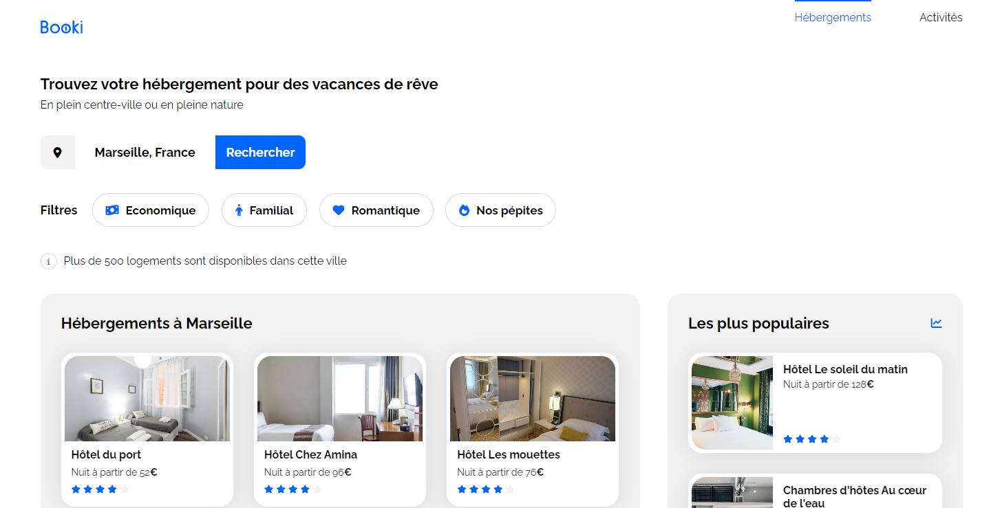

# Site Booki - Openclassrooms

## Description

Intégration d'une maquette pour un site de location d'appartement Booki. Codé en HTML et CSS, le site est responsive.  
Apprentissage des balises HTML pour le SEO et structure du code CSS. 

**Tags**: *HTML, CSS, responsive*

  

